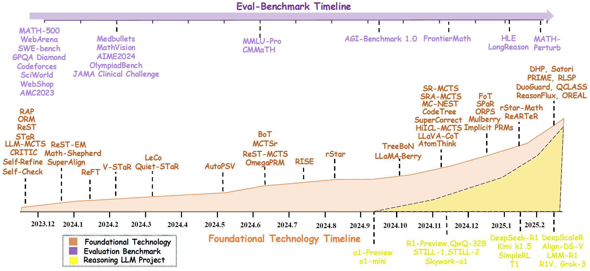

# Awesome-System-2-AI

 

<!-- omit in toc -->
## 📢 Updates

- **2025.02**: We released a survey paper "[From System 1 to System 2: A Survey of Large Language Model Reasoning](https://arxiv.org/pdf/2502.xxxxx)". Feel free to cite or open pull requests.

<!-- omit in toc -->
## 👀 Introduction

Welcome to the repository for our survey paper, "From System 1 to System 2: A Survey of Large Language Model Reasoning". This repository provides resources and updates related to our research. For a detailed introduction, please refer to [our survey paper](https://arxiv.org/pdf/2502.xxxxx).

Achieving human-level intelligence requires enhancing the transition from System 1 (fast, intuitive) to System 2 (slow, deliberate) reasoning. While foundational Large Language Models (LLMs) have made significant strides, they still fall short of human-like reasoning in complex tasks. Recent reasoning LLMs, like OpenAI’s o1, have demonstrated expert-level performance in domains such as mathematics and coding, resembling System 2 thinking. This survey explores the development of reasoning LLMs, their foundational technologies, benchmarks, and future directions. We maintain an up-to-date GitHub repository to track the latest developments in this rapidly evolving field.

This image highlights the progression of AI systems, emphasizing the shift from rapid, intuitive approaches to deliberate, reasoning-driven models. It shows how AI has evolved to handle a broader range of real-world challenges.

This timeline tracks the development of reasoning LLMs, focusing on the evolution of datasets, foundational technologies, and the release of both commercial and open-source projects. Our starting point is OpenAI's SuperAlign technology report from November 2023.

<!-- omit in toc -->
## 📒 Table of Contents

- [Awesome-System-2-AI](#awesome-system-2-ai)
  - [Part 1: O1 Replication](#part-1-o1-replication)
  - [Part 2: Process Reward Models](#part-2-process-reward-models)
  - [Part 3: Reinforcement Learning](#part-3-reinforcement-learning)
  - [Part 4: MCTS/Tree Search](#part-4-mctstree-search)
  - [Part 5: Self-Training / Self-Improve](#part-5-self-training--self-improve)
  - [Part 6: Reflection](#part-6-reflection)
  - [Part 7: Efficient System2](#part-7-efficient-system2)
  - [Part 8: Explainability](#part-8-explainability)
  - [Part 9: Multimodal Agent related Slow-Fast System](#part-9-multimodal-agent-related-slow-fast-system)
  - [Part 10: Benchmark and Datasets](#part-10-benchmark-and-datasets)

## Part 1: O1 Replication
* Imitate, Explore, and Self-Improve: A Reproduction Report on Slow-thinking Reasoning Systems [[Paper]](https://arxiv.org/abs/2412.09413) 
* o1-Coder: an o1 Replication for Coding [[Paper]](https://arxiv.org/abs/2412.00154) 
* Enhancing LLM Reasoning with Reward-guided Tree Search [[Paper]](https://arxiv.org/abs/2411.11694) 
* Marco-o1: Towards Open Reasoning Models for Open-Ended Solutions [[Paper]](https://arxiv.org/abs/2411.14405) 
* O1 Replication Journey--Part 2: Surpassing O1-preview through Simple Distillation, Big Progress or Bitter Lesson? [[Paper]](https://arxiv.org/abs/2411.16489) 
* O1 Replication Journey: A Strategic Progress Report -- Part 1 [[Paper]](https://arxiv.org/abs/2410.18982) 
## Part 2: Process Reward Models
* PRMBench: A Fine-grained and Challenging Benchmark for Process-Level Reward Models. [[Paper]](https://arxiv.org/abs/2501.03124) 
* ReARTeR: Retrieval-Augmented Reasoning with Trustworthy Process Rewarding [[Paper]](https://arxiv.org/abs/2501.07861) 
* The Lessons of Developing Process Reward Models in Mathematical Reasoning. [[Paper]](https://arxiv.org/abs/2501.07301) 
* ToolComp: A Multi-Tool Reasoning & Process Supervision Benchmark. [[Paper]](https://arxiv.org/abs/2501.01290) 
* AutoPSV: Automated Process-Supervised Verifier [[Paper]](https://openreview.net/forum?id=eOAPWWOGs9) 
* ReST-MCTS*: LLM Self-Training via Process Reward Guided Tree Search [[Paper]](https://openreview.net/forum?id=8rcFOqEud5) 
* Free Process Rewards without Process Labels. [[Paper]](https://arxiv.org/abs/2412.01981) 
* Outcome-Refining Process Supervision for Code Generation [[Paper]](https://arxiv.org/abs/2412.15118) 
* Math-Shepherd: Verify and Reinforce LLMs Step-by-step without Human Annotations [[Paper]](https://aclanthology.org/2024.acl-long.510/) 
* OVM: Outcome-supervised Value Models for Planning in Mathematical Reasoning [[Paper]](https://aclanthology.org/2024.findings-naacl.55/) 
* Step-DPO: Step-wise Preference Optimization for Long-chain Reasoning of LLMs [[Paper]](https://arxiv.org/abs/2406.18629) 
* Let's Verify Step by Step. [[Paper]](https://arxiv.org/abs/2305.20050) 
* Improve Mathematical Reasoning in Language Models by Automated Process Supervision [[Paper]](https://arxiv.org/abs/2306.05372) 
* Making Large Language Models Better Reasoners with Step-Aware Verifier [[Paper]](https://arxiv.org/abs/2206.02336) 
* Solving Math Word Problems with Process and Outcome-Based Feedback [[Paper]](https://arxiv.org/abs/2211.14275) 
## Part 3: Reinforcement Learning
* Satori: Reinforcement Learning with Chain-of-Action-Thought Enhances LLM Reasoning via Autoregressive Search [[Paper]](https://arxiv.org/abs/2502.02508) 
* Advancing Language Model Reasoning through Reinforcement Learning and Inference Scaling [[Paper]](https://arxiv.org/abs/2501.11651) 
* Challenges in Ensuring AI Safety in DeepSeek-R1 Models: The Shortcomings of Reinforcement Learning Strategies [[Paper]](https://arxiv.org/abs/2501.17030) 
* DeepSeek-R1: Incentivizing Reasoning Capability in LLMs via Reinforcement Learning [[Paper]](https://arxiv.org/abs/2501.12948) 
* Kimi k1.5: Scaling Reinforcement Learning with LLMs [[Paper]](https://arxiv.org/abs/2501.12599) 
* Does RLHF Scale? Exploring the Impacts From Data, Model, and Method [[Paper]](https://arxiv.org/abs/2412.06000) 
* Offline Reinforcement Learning for LLM Multi-Step Reasoning [[Paper]](https://arxiv.org/abs/2412.16145) 
* ReFT: Representation Finetuning for Language Models [[Paper]](https://aclanthology.org/2024.acl-long.410.pdf) 
* Deepseekmath: Pushing the limits of mathematical reasoning in open language models [[Paper]](https://arxiv.org/abs/2402.03300) 
## Part 4: MCTS/Tree Search
* On the Convergence Rate of MCTS for the Optimal Value Estimation in Markov Decision Processes [[Paper]](https://ieeexplore.ieee.org/abstract/document/10870057/) 
* Search-o1: Agentic Search-Enhanced Large Reasoning Models [[Paper]](https://arxiv.org/abs/2501.05366) 
* rStar-Math: Small LLMs Can Master Math Reasoning with Self-Evolved Deep Thinking [[Paper]](https://arxiv.org/abs/2501.04519) 
* ReST-MCTS*: LLM Self-Training via Process Reward Guided Tree Search [[Paper]](https://arxiv.org/abs/2406.03816) 
* Forest-of-Thought: Scaling Test-Time Compute for Enhancing LLM Reasoning [[Paper]](https://arxiv.org/abs/2412.09078) 
* HuatuoGPT-o1, Towards Medical Complex Reasoning with LLMs [[Paper]](https://arxiv.org/abs/2412.18925) 
* Mulberry: Empowering MLLM with o1-like Reasoning and Reflection via Collective Monte Carlo Tree Search [[Paper]](https://arxiv.org/abs/2412.18319) 
* Proposing and solving olympiad geometry with guided tree search [[Paper]](https://arxiv.org/abs/2412.10673) 
* SPaR: Self-Play with Tree-Search Refinement to Improve Instruction-Following in Large Language Models [[Paper]](https://arxiv.org/abs/2412.11605) 
* Towards Intrinsic Self-Correction Enhancement in Monte Carlo Tree Search Boosted Reasoning via Iterative Preference Learning [[Paper]](https://arxiv.org/abs/2412.17397) 
* CodeTree: Agent-guided Tree Search for Code Generation with Large Language Models [[Paper]](https://arxiv.org/abs/2411.04329) 
* GPT-Guided Monte Carlo Tree Search for Symbolic Regression in Financial Fraud Detection [[Paper]](https://arxiv.org/abs/2411.04459) 
* MC-NEST -- Enhancing Mathematical Reasoning in Large Language Models with a Monte Carlo Nash Equilibrium Self-Refine Tree [[Paper]](https://arxiv.org/abs/2411.15645) 
* Marco-o1: Towards Open Reasoning Models for Open-Ended Solutions [[Paper]](https://arxiv.org/abs/2411.14405) 
* SRA-MCTS: Self-driven Reasoning Augmentation with Monte Carlo Tree Search for Code Generation [[Paper]](https://arxiv.org/abs/2411.11053) 
* Don’t throw away your value model! Generating more preferable text with Value-Guided Monte-Carlo Tree Search decoding [[Paper]](https://openreview.net/forum?id=kh9Zt2Ldmn#discussion) 
* AFlow: Automating Agentic Workflow Generation [[Paper]](https://arxiv.org/abs/2410.10762) 
* Interpretable Contrastive Monte Carlo Tree Search Reasoning [[Paper]](https://arxiv.org/abs/2410.01707) 
* LLaMA-Berry: Pairwise Optimization for O1-like Olympiad-Level Mathematical Reasoning [[Paper]](https://arxiv.org/abs/2410.02884) 
* Towards Self-Improvement of LLMs via MCTS: Leveraging Stepwise Knowledge with Curriculum Preference Learning [[Paper]](https://arxiv.org/abs/2410.06508) 
* TreeBoN: Enhancing Inference-Time Alignment with Speculative Tree-Search and Best-of-N Sampling [[Paper]](https://arxiv.org/abs/2410.16033) 
* Understanding When Tree of Thoughts Succeeds: Larger Models Excel in Generation, Not Discrimination [[Paper]](https://arxiv.org/abs/2410.17820) 
* RethinkMCTS: Refining Erroneous Thoughts in Monte Carlo Tree Search for Code Generation [[Paper]](https://arxiv.org/abs/2409.09584) 
* Strategist: Learning Strategic Skills by LLMs via Bi-Level Tree Search [[Paper]](https://arxiv.org/abs/2408.10635) 
* LiteSearch: Efficacious Tree Search for LLM [[Paper]](https://arxiv.org/abs/2407.00320) 
* Tree Search for Language Model Agents [[Paper]](https://arxiv.org/abs/2407.01476) 
* Uncertainty-Guided Optimization on Large Language Model Search Trees [[Paper]](https://arxiv.org/abs/2407.03951) 
* Accessing GPT-4 level Mathematical Olympiad Solutions via Monte Carlo Tree Self-refine with LLaMa-3 8B [[Paper]](https://arxiv.org/abs/2406.07394) 
* Beyond A*: Better Planning with Transformers via Search Dynamics Bootstrapping [[Paper]](https://openreview.net/forum?id=rviGTsl0oy) 
* LLM Reasoners: New Evaluation, Library, and Analysis of Step-by-Step Reasoning with Large Language Models [[Paper]](https://openreview.net/forum?id=h1mvwbQiXR) 
* AlphaMath Almost Zero: process Supervision without process [[Paper]](https://arxiv.org/abs/2405.03553) 
* Generating Code World Models with Large Language Models Guided by Monte Carlo Tree Search [[Paper]](https://arxiv.org/abs/2405.15383) 
* MindStar: Enhancing Math Reasoning in Pre-trained LLMs at Inference Time [[Paper]](https://arxiv.org/abs/2405.16265) 
* Monte Carlo Tree Search Boosts Reasoning via Iterative Preference Learning [[Paper]](https://arxiv.org/abs/2405.00451) 
* Monte Carlo Tree Search Boosts Reasoning via Iterative Preference Learning [[Paper]](https://arxiv.org/abs/2405.00451) 
* Stream of Search (SoS): Learning to Search in Language [[Paper]](https://arxiv.org/abs/2404.03683) 
* Toward Self-Improvement of LLMs via Imagination, Searching, and Criticizing [[Paper]](https://arxiv.org/abs/2404.12253) 
* Reasoning with Language Model is Planning with World Model [[Paper]](https://aclanthology.org/2023.emnlp-main.507/) 
* Large Language Models as Commonsense Knowledge for Large-Scale Task Planning [[Paper]](https://proceedings.neurips.cc/paper_files/paper/2023/hash/65a39213d7d0e1eb5d192aa77e77eeb7-Abstract-Conference.html) 
* ALPHAZERO-LIKE TREE-SEARCH CAN GUIDE LARGE LANGUAGE MODEL DECODING AND TRAINING [[Paper]](https://openreview.net/forum?id=PJfc4x2jXY) 
* Alphazero-like Tree-Search can Guide Large Language Model Decoding and Training [[Paper]](https://openreview.net/forum?id=PJfc4x2jXY) 
* MAKING PPO EVEN BETTER: VALUE-GUIDED MONTE-CARLO TREE SEARCH DECODING [[Paper]](https://arxiv.org/abs/2309.15028) 
## Part 5: Self-Training / Self-Improve
* Small LLMs Can Master Reasoning with Self-Evolved Deep Thinking (Rstar-Math) [[Paper]](https://arxiv.org/abs/2501.04519) 
* ReST-MCTS*: LLM Self-Training via Process Reward Guided Tree Search [[Paper]](https://arxiv.org/abs/2406.03816) 
* Recursive Introspection: Teaching Language Model Agents How to Self-Improve [[Paper]](https://openreview.net/forum?id=DRC9pZwBwR) 
* B-STaR: Monitoring and Balancing Exploration and Exploitation in Self-Taught Reasoner [[Paper]](https://arxiv.org/abs/2412.17256) 
* ReST-EM: Beyond Human Data: Scaling Self-Training for Problem-Solving with Language Models [[Paper]](https://openreview.net/forum?id=lNAyUngGFK) 
* ReFT: Representation Finetuning for Language Models [[Paper]](https://aclanthology.org/2024.acl-long.410.pdf) 
* Interactive Evolution: A Neural-Symbolic Self-Training Framework for Large Language Models [[Paper]](https://arxiv.org/abs/2406.11736) 
* CRITIC: Large Language Models Can Self-Correct with Tool-Interactive Critiquing [[Paper]](https://openreview.net/forum?id=Sx038qxjek) 
* Enhancing Large Vision Language Models with Self-Training on Image Comprehension [[Paper]](https://arxiv.org/abs/2405.19716) 
* Quiet-STaR: Language Models Can Teach Themselves to Think Before Speaking [[Paper]](https://arxiv.org/abs/2403.09629) 
* V-star: Training Verifiers for Self-Taught Reasoners [[Paper]](https://arxiv.org/abs/2402.06457) 
* Self-Refine: Iterative Refinement with Self-Feedback [[Paper]](https://proceedings.neurips.cc/paper_files/paper/2023/hash/91edff07232fb1b55a505a9e9f6c0ff3-Abstract-Conference.html) 
* ReST: Reinforced Self-Training for Language Modeling [[Paper]](https://arxiv.org/abs/2308.08998) 
* STaR: Bootstrapping Reasoning With Reasoning [[Paper]](https://arxiv.org/abs/2203.14465) 
* Expert Iteration: Thinking Fast and Slow with Deep Learning and Tree Search [[Paper]](https://proceedings.neurips.cc/paper/2017/hash/d8e1344e27a5b08cdfd5d027d9b8d6de-Abstract.html) 
## Part 6: Reflection
* HuatuoGPT-o1, Towards Medical Complex Reasoning with LLMs [[Paper]](https://arxiv.org/abs/2412.18925) 
* AtomThink: A Slow Thinking Framework for Multimodal Mathematical Reasoning [[Paper]](https://arxiv.org/abs/2411.11930) 
* LLaVA-o1: Let Vision Language Models Reason Step-by-Step [[Paper]](https://arxiv.org/abs/2411.10440) 
* Vision-Language Models Can Self-Improve Reasoning via Reflection [[Paper]](https://arxiv.org/abs/2411.00855) 
* Mutual Reasoning Makes Smaller LLMs Stronger Problem-Solvers [[Paper]](https://arxiv.org/abs/2408.06195) 
* Reflection-Tuning: An Approach for Data Recycling [[Paper]](https://arxiv.org/abs/2310.11716) 
## Part 7: Efficient System2
* O1-Pruner: Length-Harmonizing Fine-Tuning for O1-Like Reasoning Pruning [[Paper]](https://arxiv.org/abs/2501.12570) 
* Think More, Hallucinate Less: Mitigating Hallucinations via Dual Process of Fast and Slow Thinking [[Paper]](https://arxiv.org/abs/2501.01306) 
* DynaThink: Fast or Slow? A Dynamic Decision-Making Framework for Large Language Models [[Paper]](https://arxiv.org/abs/2407.01009) 
* B-STaR: Monitoring and Balancing Exploration and Exploitation in Self-Taught Reasoner [[Paper]](https://arxiv.org/abs/2412.17256) 
* Token-Budget-Aware LLM Reasoning [[Paper]](https://arxiv.org/abs/2412.18547) 
* Training Large Language Models to Reason in a Continuous Latent Space [[Paper]](https://arxiv.org/abs/2412.06769) 
* Guiding Language Model Reasoning with Planning Tokens [[Paper]](https://arxiv.org/abs/2310.05707) 
## Part 8: Explainability
* Agents Thinking Fast and Slow: A Talker-Reasoner Architecture [[Paper]](https://openreview.net/forum?id=xPhcP6rbI4) 
* What Happened in LLMs Layers when Trained for Fast vs. Slow Thinking: A Gradient Perspective [[Paper]](https://arxiv.org/abs/2410.23743) 
* When a Language Model is Optimized for Reasoning, Does It Still Show Embers of Autoregression? An Analysis of OpenAI o1 [[Paper]](https://arxiv.org/abs/2410.01792) 
* The Impact of Reasoning Step Length on Large Language Models [[Paper]](https://arxiv.org/abs/2401.04925) 
* Distilling System 2 into System 1 [[Paper]](https://arxiv.org/abs/2407.06023) 
* System 2 Attention (is something you might need too) [[Paper]](https://arxiv.org/abs/2311.11829) 
## Part 9: Multimodal Agent related Slow-Fast System
* Diving into Self-Evolving Training for Multimodal Reasoning [[Paper]](https://arxiv.org/abs/2412.17451) 
* Visual Agents as Fast and Slow Thinkers [[Paper]](https://openreview.net/forum?id=ncCuiD3KJQ) 
* Virgo: A Preliminary Exploration on Reproducing o1-like MLLM [[Paper]](https://arxiv.org/abs/2501.01904) 
* Scaling Inference-Time Search With Vision Value Model for Improved Visual Comprehension [[Paper]](https://arxiv.org/pdf/2412.03704) 
* Slow Perception: Let's Perceive Geometric Figures Step-by-Step [[Paper]](https://arxiv.org/abs/2412.20631) 
* AtomThink: A Slow Thinking Framework for Multimodal Mathematical Reasoning [[Paper]](https://arxiv.org/abs/2411.11930) 
* LLaVA-o1: Let Vision Language Models Reason Step-by-Step [[Paper]](https://arxiv.org/abs/2411.10440) 
* Vision-Language Models Can Self-Improve Reasoning via Reflection [[Paper]](https://arxiv.org/abs/2411.00855) 
## Part 10: Benchmark and Datasets
* PRMBench: A Fine-grained and Challenging Benchmark for Process-Level Reward Models [[Paper]](https://arxiv.org/abs/2501.03124) 
* MR-Ben: A Meta-Reasoning Benchmark for Evaluating System-2 Thinking in LLMs [[Paper]](https://openreview.net/forum?id=GN2qbxZlni) 
* Do NOT Think That Much for 2+3=? On the Overthinking of o1-like LLMs [[Paper]](https://arxiv.org/abs/2412.21187) 
* A Preliminary Study of o1 in Medicine: Are We Closer to an AI Doctor? [[Paper]](https://arxiv.org/abs/2409.15277) 

<!-- omit in toc -->
## ⭐ Star History

<a href="https://star-history.com/#zzli2022/Awesome-Slow-Reason-System&Date">
 <picture>
   <source media="(prefers-color-scheme: dark)" srcset="https://api.star-history.com/svg?repos=zzli2022/Awesome-Slow-Reason-System&type=Date&theme=dark" />
   <source media="(prefers-color-scheme: light)" srcset="https://api.star-history.com/svg?repos=zzli2022/Awesome-Slow-Reason-System&type=Date" />
   
 </picture>
</a>