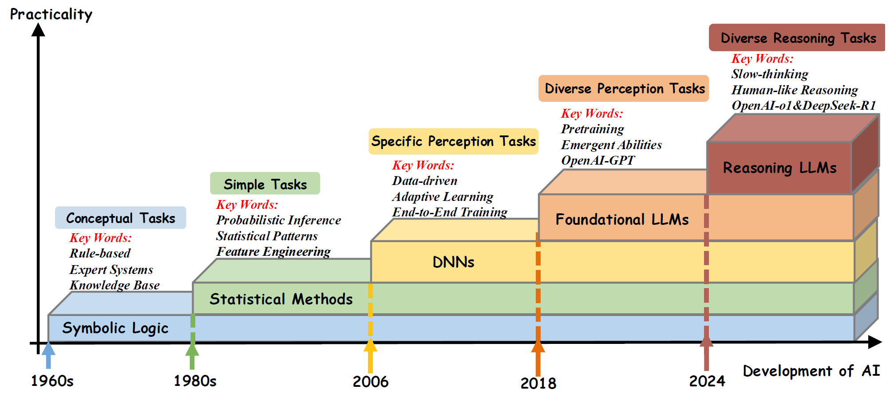
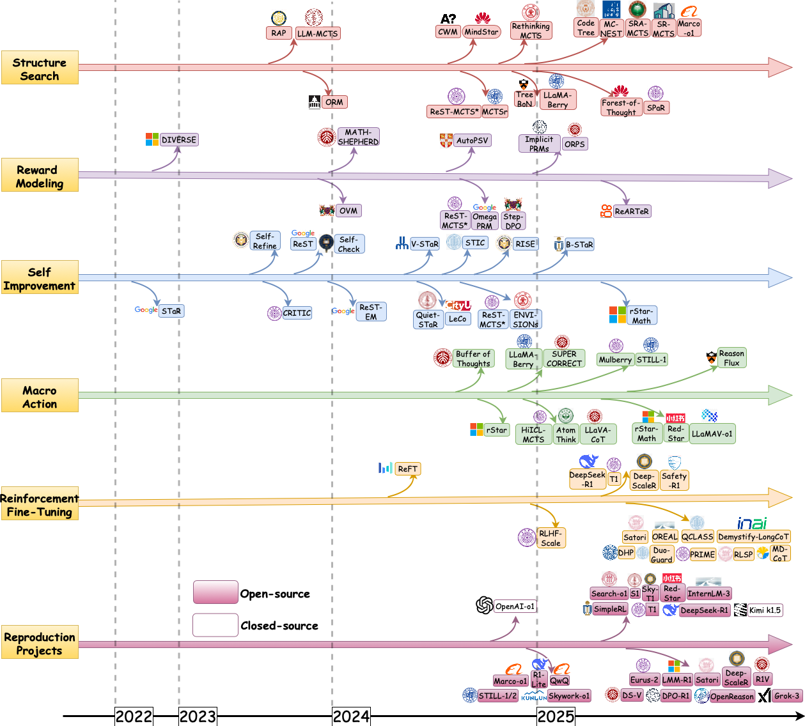

# Awesome-System2-Reasoning-LLM

[](http://arxiv.org/abs/2502.17419) 
[](https://github.com/zzli2022/System2-Reasoning-LLM)
[](https://github.com/zzli2022/System2-Reasoning-LLM)
[]()

<!-- omit in toc -->
## 📢 Updates

- **2025.02**: We released a survey paper "[From System 1 to System 2: A Survey of Reasoning Large Language Models](http://arxiv.org/abs/2502.17419)". Feel free to cite or open pull requests.

<!-- omit in toc -->
## 👀 Introduction

Welcome to the repository for our survey paper, "From System 1 to System 2: A Survey of Reasoning Large Language Models". This repository provides resources and updates related to our research. For a detailed introduction, please refer to [our survey paper](http://arxiv.org/abs/2502.17419).

Achieving human-level intelligence requires enhancing the transition from System 1 (fast, intuitive) to System 2 (slow, deliberate) reasoning. While foundational Large Language Models (LLMs) have made significant strides, they still fall short of human-like reasoning in complex tasks. Recent reasoning LLMs, like OpenAI’s o1, have demonstrated expert-level performance in domains such as mathematics and coding, resembling System 2 thinking. This survey explores the development of reasoning LLMs, their foundational technologies, benchmarks, and future directions. We maintain an up-to-date GitHub repository to track the latest developments in this rapidly evolving field.




This image highlights the progression of AI systems, emphasizing the shift from rapid, intuitive approaches to deliberate, reasoning-driven models. It shows how AI has evolved to handle a broader range of real-world challenges.


The recent timeline of reasoning LLMs, covering core methods and the release of open-source and closed-source reproduction projects.

<!-- omit in toc -->
## 📒 Table of Contents

- [Awesome-System-2-AI](#awesome-system-2-ai)
  - [Part 1: O1 Replication](#part-1-o1-replication)
  - [Part 2: Process Reward Models](#part-2-process-reward-models)
  - [Part 3: Reinforcement Learning](#part-3-reinforcement-learning)
  - [Part 4: MCTS/Tree Search](#part-4-mctstree-search)
  - [Part 5: Self-Training / Self-Improve](#part-5-self-training--self-improve)
  - [Part 6: Reflection](#part-6-reflection)
  - [Part 7: Efficient System2](#part-7-efficient-system2)
  - [Part 8: Explainability](#part-8-explainability)
  - [Part 9: Multimodal Agent related Slow-Fast System](#part-9-multimodal-agent-related-slow-fast-system)
  - [Part 10: Benchmark and Datasets](#part-10-benchmark-and-datasets)
  - [Part 11: Reasoning and Safety](#part-11-reasoning-and-safety)
  - [Part 12: R1 Driven Multimodal Reasoning Enhancement](#part-12-r1-driven-multimodal-reasoning-enhancement)

## Part 1: O1 Replication

* O1 Replication Journey: A Strategic Progress Report -- Part 1 [[Paper]](https://arxiv.org/abs/2410.18982) 
* Enhancing LLM Reasoning with Reward-guided Tree Search [[Paper]](https://arxiv.org/abs/2411.11694) 
* Marco-o1: Towards Open Reasoning Models for Open-Ended Solutions [[Paper]](https://arxiv.org/abs/2411.14405) 
* O1 Replication Journey--Part 2: Surpassing O1-preview through Simple Distillation, Big Progress or Bitter Lesson? [[Paper]](https://arxiv.org/abs/2411.16489) 
* Imitate, Explore, and Self-Improve: A Reproduction Report on Slow-thinking Reasoning Systems [[Paper]](https://arxiv.org/abs/2412.09413) 
* o1-Coder: an o1 Replication for Coding [[Paper]](https://arxiv.org/abs/2412.00154) 
* HuatuoGPT-o1, Towards Medical Complex Reasoning with LLMs [[Paper]](https://arxiv.org/abs/2412.18925) 
* DRT: Deep Reasoning Translation via Long Chain-of-Thought [[Paper]](https://arxiv.org/abs/2412.17498) 
* mini-deepseek-r1 [[Blog]](https://www.philschmid.de/mini-deepseek-r1) 
* Run DeepSeek R1 Dynamic 1.58-bit [[Blog]](https://unsloth.ai/blog/deepseekr1-dynamic) 
* Simple Reinforcement Learning for Reasoning [[Notion]](https://hkust-nlp.notion.site/simplerl-reason) 
* TinyZero [[github]](https://github.com/Jiayi-Pan/TinyZero) 
* Open R1 [[github]](https://github.com/huggingface/open-r1) 
* Search-o1: Agentic Search-Enhanced Large Reasoning Models [[Paper]](https://arxiv.org/abs/2501.05366) 
* Virgo: A Preliminary Exploration on Reproducing o1-like MLLM [[Paper]](https://arxiv.org/abs/2501.01904) 
* The Relationship Between Reasoning and Performance in Large Language Models -- o3 (mini) Thinks Harder, Not Longer [[Paper]](https://arxiv.org/abs/2502.15631) 
* Open-Reasoner-Zero [[Paper]](https://github.com/Open-Reasoner-Zero/Open-Reasoner-Zero/blob/main/ORZ_paper.pdf) 
* X-R1 [[github]](https://github.com/dhcode-cpp/X-R1) 
* Unlock-Deepseek [[Blog]](https://mp.weixin.qq.com/s/Z7P61IV3n4XYeC0Et_fvwg) 
* Logic-RL: Unleashing LLM Reasoning with Rule-Based Reinforcement Learning [[Paper]](https://arxiv.org/abs/2502.14768) 
* LLM-R1 [[github]](https://github.com/TideDra/lmm-r1) 
## Part 2: Process Reward Models

* Solving Math Word Problems with Process and Outcome-Based Feedback [[Paper]](https://arxiv.org/abs/2211.14275) 
* Improve Mathematical Reasoning in Language Models by Automated Process Supervision [[Paper]](https://arxiv.org/abs/2306.05372) 
* Making Large Language Models Better Reasoners with Step-Aware Verifier [[Paper]](https://arxiv.org/abs/2206.02336) 
* Math-Shepherd: Verify and Reinforce LLMs Step-by-step without Human Annotations [[Paper]](https://aclanthology.org/2024.acl-long.510/) 
* OVM: Outcome-supervised Value Models for Planning in Mathematical Reasoning [[Paper]](https://aclanthology.org/2024.findings-naacl.55/) 
* Let's Verify Step by Step. [[Paper]](https://arxiv.org/abs/2305.20050) 
* Step-DPO: Step-wise Preference Optimization for Long-chain Reasoning of LLMs [[Paper]](https://arxiv.org/abs/2406.18629) 
* AutoPSV: Automated Process-Supervised Verifier [[Paper]](https://openreview.net/forum?id=eOAPWWOGs9) 
* ReST-MCTS*: LLM Self-Training via Process Reward Guided Tree Search [[Paper]](https://openreview.net/forum?id=8rcFOqEud5) 
* Free Process Rewards without Process Labels. [[Paper]](https://arxiv.org/abs/2412.01981) 
* Outcome-Refining Process Supervision for Code Generation [[Paper]](https://arxiv.org/abs/2412.15118) 
* PRMBench: A Fine-grained and Challenging Benchmark for Process-Level Reward Models. [[Paper]](https://arxiv.org/abs/2501.03124) 
* ReARTeR: Retrieval-Augmented Reasoning with Trustworthy Process Rewarding [[Paper]](https://arxiv.org/abs/2501.07861) 
* The Lessons of Developing Process Reward Models in Mathematical Reasoning. [[Paper]](https://arxiv.org/abs/2501.07301) 
* ToolComp: A Multi-Tool Reasoning & Process Supervision Benchmark. [[Paper]](https://arxiv.org/abs/2501.01290) 
* ARMAP: Scaling Autonomous Agents via Automatic Reward Modeling And Planning [[Paper]](https://arxiv.org/abs/2502.12130) 
* Uncertainty-Aware Step-wise Verification with Generative Reward Models [[Paper]](https://arxiv.org/abs/2502.11250) 
* AdaptiveStep: Automatically Dividing Reasoning Step through Model Confidence [[Paper]](https://www.arxiv.org/abs/2502.13943) 
* Self-Consistency of the Internal Reward Models Improves Self-Rewarding Language Models [[Paper]](https://www.arxiv.org/abs/2502.08922) 
* Can 1B LLM Surpass 405B LLM? Rethinking Compute-Optimal Test-Time Scaling [[Paper]](https://arxiv.org/abs/2502.06703) 
* Agentic Reward Modeling: Integrating Human Preferences with Verifiable Correctness Signals for Reliable Reward Systems [[Paper]](https://arxiv.org/abs/2502.19328) 
* Unified Reward Model for Multimodal Understanding and Generation [[Paper]](https://arxiv.org/abs/2503.05236) 
* Reward Shaping to Mitigate Reward Hacking in RLHF [[Paper]](https://arxiv.org/abs/2502.18770) 
* Multi-head Reward Aggregation Guided by Entropy [[Paper]](https://arxiv.org/abs/2503.20995) 
*   [[Paper]](https://arxiv.org/abs/2503.21295) 
* Better Process Supervision with Bi-directional Rewarding Signals [[Paper]](https://arxiv.org/abs/2503.04618) 
* Inference-Time Scaling for Generalist Reward Modeling [[Paper]](https://arxiv.org/abs/2504.02495) 

## Part 3: Reinforcement Learning

* Improve Vision Language Model Chain-of-thought Reasoning [[Paper]](https://arxiv.org/abs/2410.16198) 
* Does RLHF Scale? Exploring the Impacts From Data, Model, and Method [[Paper]](https://arxiv.org/abs/2412.06000) 
* Offline Reinforcement Learning for LLM Multi-Step Reasoning [[Paper]](https://arxiv.org/abs/2412.16145) 
* ReFT: Representation Finetuning for Language Models [[Paper]](https://aclanthology.org/2024.acl-long.410.pdf) 
* InfAlign: Inference-aware language model alignment [[Paper]](https://arxiv.org/abs/2412.19792) 
* Advancing Language Model Reasoning through Reinforcement Learning and Inference Scaling [[Paper]](https://arxiv.org/abs/2501.11651) 
* Challenges in Ensuring AI Safety in DeepSeek-R1 Models: The Shortcomings of Reinforcement Learning Strategies [[Paper]](https://arxiv.org/abs/2501.17030) 
* DeepSeek-R1: Incentivizing Reasoning Capability in LLMs via Reinforcement Learning [[Paper]](https://arxiv.org/abs/2501.12948) 
* Kimi k1.5: Scaling Reinforcement Learning with LLMs [[Paper]](https://arxiv.org/abs/2501.12599) 
* Deepseekmath: Pushing the limits of mathematical reasoning in open language models [[Paper]](https://arxiv.org/abs/2402.03300) 
* Reasoning with Reinforced Functional Token Tuning [[Paper]](https://arxiv.org/abs/2502.13389) 
* Value-Based Deep RL Scales Predictably [[Paper]](https://arxiv.org/abs/2502.04327) 
* MM-RLHF: The Next Step Forward in Multimodal LLM Alignment [[Paper]](https://arxiv.org/abs/2502.10391) 
* Satori: Reinforcement Learning with Chain-of-Action-Thought Enhances LLM Reasoning via Autoregressive Search [[Paper]](https://arxiv.org/abs/2502.02508) 
* DeepScaleR: Surpassing O1-Preview with a 1.5B Model by Scaling RL [[Paper]](https://pretty-radio-b75.notion.site/DeepScaleR-Surpassing-O1-Preview-with-a-1-5B-Model-by-Scaling-RL-19681902c1468005bed8ca303013a4e2) 
* LIMR: Less is More for RL Scaling [[Paper]](https://arxiv.org/abs/2502.11886) 
* A Survey on Feedback-based Multi-step Reasoning for Large Language Models on Mathematics [[Paper]](https://arxiv.org/abs/2502.143) 
* Med-RLVR: Emerging Medical Reasoning from a 3B base model via reinforcement Learning [[Paper]](https://arxiv.org/abs/2502.19655) 
* QLASS: Boosting Language Agent Inference via Q-Guided Stepwise Search [[Paper]](https://arxiv.org/abs/2502.02584) 
* Process Reinforcement through Implicit Rewards [[Paper]](https://arxiv.org/abs/2502.01456) 
* UI-R1: Enhancing Action Prediction of GUI Agents by Reinforcement Learning [[Paper]](https://arxiv.org/abs/2503.21620) 
* All Roads Lead to Likelihood: The Value of Reinforcement Learning in Fine-Tuning [[Paper]](https://arxiv.org/abs/2503.01067) 
* R1-Zero's "Aha Moment" in Visual Reasoning on a 2B Non-SFT Model [[Paper]](https://arxiv.org/abs/2503.05132) 
* Visual-RFT: Visual Reinforcement Fine-Tuning [[Paper]](https://arxiv.org/abs/2503.01785) 
* GTR: Guided Thought Reinforcement Prevents Thought Collapse in RL-based VLM Agent Training [[Paper]](https://arxiv.org/abs/2503.08525) 
* L1: Controlling How Long A Reasoning Model Thinks With Reinforcement Learning [[Paper]](https://arxiv.org/abs/2503.04697) 
* Reinforcement Learning for Reasoning in Small LLMs: What Works and What Doesn't [[Paper]](https://arxiv.org/abs/2503.16219) 
*  Boosting the Generalization and Reasoning of Vision Language Models with Curriculum Reinforcement [[Paper]](https://arxiv.org/abs/2503.07065) 
*  VLAA-Thinker [[github]](https://github.com/UCSC-VLAA/VLAA-Thinking/) 
*  Concise Reasoning via Reinforcement Learning [[Paper]](https://arxiv.org/abs/2504.05185) 
*  d1: Scaling Reasoning in Diffusion Large Language Models via Reinforcement Learning [[github]](https://dllm-reasoning.github.io/media/preprint.pdf) 
*  Algorithm Discovery With LLMs: Evolutionary Search Meets Reinforcement Learning [[Paper]](https://arxiv.org/abs/2504.05108) 
*  Efficient Reinforcement Finetuning via Adaptive Curriculum Learning [[Paper]](https://arxiv.org/pdf/2504.05520) 
*  VideoChat-R1: Enhancing Spatio-Temporal Perception via Reinforcement Fine-Tuning [[Paper]](https://arxiv.org/abs/2504.06958) 
*  SFT or RL? An Early Investigation into Training R1-Like Reasoning Large Vision-Language Models [[Paper]](https://arxiv.org/abs/2504.11468) 
*  RAISE: Reinforenced Adaptive Instruction Selection For Large Language Models [[Paper]](https://arxiv.org/abs/2504.07282) 
*  MT-R1-Zero: Advancing LLM-based Machine Translation via R1-Zero-like Reinforcement Learning [[Paper]](https://arxiv.org/abs/2504.10160) 
*  VisRL: Intention-Driven Visual Perception via Reinforced Reasoning [[Paper]](https://arxiv.org/abs/2503.07523) 

## Part 4: MCTS/Tree Search

* Reasoning with Language Model is Planning with World Model [[Paper]](https://aclanthology.org/2023.emnlp-main.507/) 
* Fine-grained Conversational Decoding via Isotropic and Proximal Search [[Paper]](https://aclanthology.org/2023.emnlp-main.5/) 
* Large Language Models as Commonsense Knowledge for Large-Scale Task Planning [[Paper]](https://proceedings.neurips.cc/paper_files/paper/2023/hash/65a39213d7d0e1eb5d192aa77e77eeb7-Abstract-Conference.html) 
* ALPHAZERO-LIKE TREE-SEARCH CAN GUIDE LARGE LANGUAGE MODEL DECODING AND TRAINING [[Paper]](https://openreview.net/forum?id=PJfc4x2jXY) 
* Alphazero-like Tree-Search can Guide Large Language Model Decoding and Training [[Paper]](https://openreview.net/forum?id=PJfc4x2jXY) 
* MAKING PPO EVEN BETTER: VALUE-GUIDED MONTE-CARLO TREE SEARCH DECODING [[Paper]](https://arxiv.org/abs/2309.15028) 
* Look-back Decoding for Open-Ended Text Generation [[Paper]](https://aclanthology.org/2023.emnlp-main.66/) 
* Stream of Search (SoS): Learning to Search in Language [[Paper]](https://arxiv.org/abs/2404.03683) 
* Toward Self-Improvement of LLMs via Imagination, Searching, and Criticizing [[Paper]](https://arxiv.org/abs/2404.12253) 
* Uncertainty of Thoughts: Uncertainty-Aware Planning Enhances Information Seeking in Large Language Models [[Paper]](https://openreview.net/forum?id=CVpuVe1N22&noteId=aTI8PGpO47) 
* AlphaMath Almost Zero: process Supervision without process [[Paper]](https://arxiv.org/abs/2405.03553) 
* Generating Code World Models with Large Language Models Guided by Monte Carlo Tree Search [[Paper]](https://arxiv.org/abs/2405.15383) 
* MindStar: Enhancing Math Reasoning in Pre-trained LLMs at Inference Time [[Paper]](https://arxiv.org/abs/2405.16265) 
* Monte Carlo Tree Search Boosts Reasoning via Iterative Preference Learning [[Paper]](https://arxiv.org/abs/2405.00451) 
* Accessing GPT-4 level Mathematical Olympiad Solutions via Monte Carlo Tree Self-refine with LLaMa-3 8B [[Paper]](https://arxiv.org/abs/2406.07394) 
* Beyond A*: Better Planning with Transformers via Search Dynamics Bootstrapping [[Paper]](https://openreview.net/forum?id=rviGTsl0oy) 
* LLM Reasoners: New Evaluation, Library, and Analysis of Step-by-Step Reasoning with Large Language Models [[Paper]](https://openreview.net/forum?id=h1mvwbQiXR) 
* LiteSearch: Efficacious Tree Search for LLM [[Paper]](https://arxiv.org/abs/2407.00320) 
* Tree Search for Language Model Agents [[Paper]](https://arxiv.org/abs/2407.01476) 
* Uncertainty-Guided Optimization on Large Language Model Search Trees [[Paper]](https://arxiv.org/abs/2407.03951) 
* Strategist: Learning Strategic Skills by LLMs via Bi-Level Tree Search [[Paper]](https://arxiv.org/abs/2408.10635) 
* RethinkMCTS: Refining Erroneous Thoughts in Monte Carlo Tree Search for Code Generation [[Paper]](https://arxiv.org/abs/2409.09584) 
* AFlow: Automating Agentic Workflow Generation [[Paper]](https://arxiv.org/abs/2410.10762) 
* Interpretable Contrastive Monte Carlo Tree Search Reasoning [[Paper]](https://arxiv.org/abs/2410.01707) 
* LLaMA-Berry: Pairwise Optimization for O1-like Olympiad-Level Mathematical Reasoning [[Paper]](https://arxiv.org/abs/2410.02884) 
* Towards Self-Improvement of LLMs via MCTS: Leveraging Stepwise Knowledge with Curriculum Preference Learning [[Paper]](https://arxiv.org/abs/2410.06508) 
* TreeBoN: Enhancing Inference-Time Alignment with Speculative Tree-Search and Best-of-N Sampling [[Paper]](https://arxiv.org/abs/2410.16033) 
* Understanding When Tree of Thoughts Succeeds: Larger Models Excel in Generation, Not Discrimination [[Paper]](https://arxiv.org/abs/2410.17820) 
* CodeTree: Agent-guided Tree Search for Code Generation with Large Language Models [[Paper]](https://arxiv.org/abs/2411.04329) 
* GPT-Guided Monte Carlo Tree Search for Symbolic Regression in Financial Fraud Detection [[Paper]](https://arxiv.org/abs/2411.04459) 
* MC-NEST -- Enhancing Mathematical Reasoning in Large Language Models with a Monte Carlo Nash Equilibrium Self-Refine Tree [[Paper]](https://arxiv.org/abs/2411.15645) 
* Marco-o1: Towards Open Reasoning Models for Open-Ended Solutions [[Paper]](https://arxiv.org/abs/2411.14405) 
* SRA-MCTS: Self-driven Reasoning Augmentation with Monte Carlo Tree Search for Code Generation [[Paper]](https://arxiv.org/abs/2411.11053) 
* Don’t throw away your value model! Generating more preferable text with Value-Guided Monte-Carlo Tree Search decoding [[Paper]](https://openreview.net/forum?id=kh9Zt2Ldmn#discussion) 
* ReST-MCTS*: LLM Self-Training via Process Reward Guided Tree Search [[Paper]](https://arxiv.org/abs/2406.03816) 
* Forest-of-Thought: Scaling Test-Time Compute for Enhancing LLM Reasoning [[Paper]](https://arxiv.org/abs/2412.09078) 
* HuatuoGPT-o1, Towards Medical Complex Reasoning with LLMs [[Paper]](https://arxiv.org/abs/2412.18925) 
* Mulberry: Empowering MLLM with o1-like Reasoning and Reflection via Collective Monte Carlo Tree Search [[Paper]](https://arxiv.org/abs/2412.18319) 
* Proposing and solving olympiad geometry with guided tree search [[Paper]](https://arxiv.org/abs/2412.10673) 
* SPaR: Self-Play with Tree-Search Refinement to Improve Instruction-Following in Large Language Models [[Paper]](https://arxiv.org/abs/2412.11605) 
* Towards Intrinsic Self-Correction Enhancement in Monte Carlo Tree Search Boosted Reasoning via Iterative Preference Learning [[Paper]](https://arxiv.org/abs/2412.17397) 
* Control-DAG: Constrained Decoding for Non-Autoregressive Directed Acyclic T5 using Weighted Finite State Automata [[Paper]](https://aclanthology.org/2024.naacl-short.42/) 
* Leveraging Constrained Monte Carlo Tree Search to Generate Reliable Long Chain-of-Thought for Mathematical Reasoning [[Paper]](https://arxiv.org/abs/2502.11169) 
* PairJudge RM: Perform Best-of-N Sampling with Knockout Tournament [[Paper]](https://arxiv.org/abs/2501.13007) 
* ARMAP: Scaling Autonomous Agents via Automatic Reward Modeling And Planning [[Paper]](https://arxiv.org/abs/2502.12130) 
* On the Convergence Rate of MCTS for the Optimal Value Estimation in Markov Decision Processes [[Paper]](https://ieeexplore.ieee.org/abstract/document/10870057/) 
* Search-o1: Agentic Search-Enhanced Large Reasoning Models [[Paper]](https://arxiv.org/abs/2501.05366) 
* rStar-Math: Small LLMs Can Master Math Reasoning with Self-Evolved Deep Thinking [[Paper]](https://arxiv.org/abs/2501.04519) 
* LeanProgress: Guiding Search for Neural Theorem Proving via Proof Progress Prediction [[Paper]](https://arxiv.org/abs/2502.17925) 
* Boosting Multimodal Reasoning with MCTS-Automated Structured Thinking [[Paper]](https://arxiv.org/abs/2502.02339) 
* DeepSolution: Boosting Complex Engineering Solution Design via Tree-based Exploration and Bi-point Thinking [[Paper]](https://arxiv.org/abs/2502.20730) 
* Hypothesis-Driven Theory-of-Mind Reasoning for Large Language Models [[Paper]](https://arxiv.org/abs/2502.11881) 
* VisuoThink: Empowering LVLM Reasoning with Multimodal Tree Search [[Paper]](https://arxiv.org/abs/2504.09130) 
## Part 5: Self-Training / Self-Improve

* Expert Iteration: Thinking Fast and Slow with Deep Learning and Tree Search [[Paper]](https://proceedings.neurips.cc/paper/2017/hash/d8e1344e27a5b08cdfd5d027d9b8d6de-Abstract.html) 
* STaR: Bootstrapping Reasoning With Reasoning [[Paper]](https://arxiv.org/abs/2203.14465) 
* Large Language Models are Better Reasoners with Self-Verification [[Paper]](/aclanthology.org/2023.findings-emnlp.167/) 
* Self-Evaluation Guided Beam Search for Reasoning [[Paper]](https://proceedings.neurips.cc/paper_files/paper/2023/hash/81fde95c4dc79188a69ce5b24d63010b-Abstract-Conference.html) 
* Self-Refine: Iterative Refinement with Self-Feedback [[Paper]](https://proceedings.neurips.cc/paper_files/paper/2023/hash/91edff07232fb1b55a505a9e9f6c0ff3-Abstract-Conference.html) 
* ReST: Reinforced Self-Training for Language Modeling [[Paper]](https://arxiv.org/abs/2308.08998) 
* Self-Refine: Iterative Refinement with Self-Feedback [[Paper]](https://proceedings.neurips.cc/paper_files/paper/2023/hash/91edff07232fb1b55a505a9e9f6c0ff3-Abstract-Conference.html) 
* V-star: Training Verifiers for Self-Taught Reasoners [[Paper]](https://arxiv.org/abs/2402.06457) 
* Quiet-STaR: Language Models Can Teach Themselves to Think Before Speaking [[Paper]](https://arxiv.org/abs/2403.09629) 
* CRITIC: Large Language Models Can Self-Correct with Tool-Interactive Critiquing [[Paper]](https://openreview.net/forum?id=Sx038qxjek) 
* Enhancing Large Vision Language Models with Self-Training on Image Comprehension [[Paper]](https://arxiv.org/abs/2405.19716) 
* Interactive Evolution: A Neural-Symbolic Self-Training Framework for Large Language Models [[Paper]](https://arxiv.org/abs/2406.11736) 
* SelfCheck: Using LLMs to Zero-Shot Check Their Own Step-by-Step Reasoning [[Paper]](https://openreview.net/forum?id=pTHfApDakA) 
* CRITIC: Large Language Models Can Self-Correct with Tool-Interactive Critiquing [[Paper]](https://openreview.net/forum?id=Sx038qxjek) 
* Learning From Correctness Without Prompting Makes LLM Efficient Reasoner [[Paper]](https://openreview.net/forum?id=dcbNzhVVQj#discussion) 
* Self-Improvement in Language Models: The Sharpening Mechanism [[Paper]](https://arxiv.org/abs/2412.01951) 
* ReST-MCTS*: LLM Self-Training via Process Reward Guided Tree Search [[Paper]](https://arxiv.org/abs/2406.03816) 
* Recursive Introspection: Teaching Language Model Agents How to Self-Improve [[Paper]](https://openreview.net/forum?id=DRC9pZwBwR) 
* B-STaR: Monitoring and Balancing Exploration and Exploitation in Self-Taught Reasoner [[Paper]](https://arxiv.org/abs/2412.17256) 
* ReST-EM: Beyond Human Data: Scaling Self-Training for Problem-Solving with Language Models [[Paper]](https://openreview.net/forum?id=lNAyUngGFK) 
* ReFT: Representation Finetuning for Language Models [[Paper]](https://aclanthology.org/2024.acl-long.410.pdf) 
* Enabling Scalable Oversight via Self-Evolving Critic [[Paper]](https://arxiv.org/abs/2501.05727) 
* S<sup>2</sup>R: Teaching LLMs to Self-verify and Self-correct via Reinforcement Learning [[Paper]](https://www.arxiv.org/abs/2502.12853) 
* ProgCo: Program Helps Self-Correction of Large Language Models [[Paper]](https://arxiv.org/abs/2501.01264) 
* Small LLMs Can Master Reasoning with Self-Evolved Deep Thinking (Rstar-Math) [[Paper]](https://arxiv.org/abs/2501.04519) 
* Self-Training Elicits Concise Reasoning in Large Language Models [[Paper]](https://arxiv.org/abs/2502.20122) 
* Language Models can Self-Improve at State-Value Estimation for Better Search [[Paper]](https://arxiv.org/abs/2503.02878) 
* Genius: A Generalizable and Purely Unsupervised Self-Training Framework For Advanced Reasonin [[Paper]](https://arxiv.org/abs/2504.08672) 
* START: Self-taught Reasoner with Tools [[Paper]](https://arxiv.org/abs/2503.04625) 
## Part 6: Reflection
* SelfCheck: Using LLMs to Zero-Shot Check Their Own Step-by-Step Reasoning [[Paper]](https://arxiv.org/abs/2308.00436) 
* Reflection-Tuning: An Approach for Data Recycling [[Paper]](https://arxiv.org/abs/2310.11716) 
* Learning From Mistakes Makes LLM Better Reasoner [[Paper]](https://arxiv.org/abs/2310.20689) 
* Mutual Reasoning Makes Smaller LLMs Stronger Problem-Solvers [[Paper]](https://arxiv.org/abs/2408.06195) 
* LLaMA-Berry: Pairwise Optimization for O1-like Olympiad-Level Mathematical Reasoning [[Paper]](https://arxiv.org/abs/2410.02884) 
* Mulberry: Empowering MLLM with o1-like Reasoning and Reflection via Collective Monte Carlo Tree Search [[Paper]](https://arxiv.org/abs/2412.18319) 
* AtomThink: A Slow Thinking Framework for Multimodal Mathematical Reasoning [[Paper]](https://arxiv.org/abs/2411.18478) 
* Beyond Examples: High-level Automated Reasoning Paradigm in In-Context Learning via MCTS [[Paper]](https://arxiv.org/abs/2411.11930) 
* Marco-o1: Towards Open Reasoning Models for Open-Ended Solutions [[Paper]](https://arxiv.org/abs/2411.14405) 
* LLaVA-o1: Let Vision Language Models Reason Step-by-Step [[Paper]](https://arxiv.org/abs/2411.10440) 
* Vision-Language Models Can Self-Improve Reasoning via Reflection [[Paper]](https://arxiv.org/abs/2411.00855) 
* HuatuoGPT-o1, Towards Medical Complex Reasoning with LLMs [[Paper]](https://arxiv.org/abs/2412.18925) 
* Refiner: Restructure Retrieved Content Efficiently to Advance Question-Answering Capabilities [[Paper]](https://aclanthology.org/2024.findings-emnlp.500/) 
* rStar-Math: Small LLMs Can Master Math Reasoning with Self-Evolved Deep Thinking [[Paper]](https://arxiv.org/abs/2501.04519) 
* RedStar: Does Scaling Long-CoT Data Unlock Better Slow-Reasoning Systems? [[Paper]](https://arxiv.org/abs/2501.11284) 
* Perception in Reflection [[Paper]](https://arxiv.org/abs/2504.07165) 
## Part 7: Efficient System2

* Guiding Language Model Reasoning with Planning Tokens [[Paper]](https://arxiv.org/abs/2310.05707) 
* AutoReason: Automatic Few-Shot Reasoning Decomposition [[Paper]](https://arxiv.org/abs/2412.06975) 
* DynaThink: Fast or Slow? A Dynamic Decision-Making Framework for Large Language Models [[Paper]](https://arxiv.org/abs/2407.01009) 
* B-STaR: Monitoring and Balancing Exploration and Exploitation in Self-Taught Reasoner [[Paper]](https://arxiv.org/abs/2412.17256) 
* Token-Budget-Aware LLM Reasoning [[Paper]](https://arxiv.org/abs/2412.18547) 
* Training Large Language Models to Reason in a Continuous Latent Space [[Paper]](https://arxiv.org/abs/2412.06769) 
* From Informal to Formal -- Incorporating and Evaluating LLMs on Natural Language Requirements to Verifiable Formal Proofs [[Paper]](https://arxiv.org/abs/2501.16207) 
* MALT: Improving Reasoning with Multi-Agent LLM Training [[Paper]](https://arxiv.org/abs/2412.01928) 
* Thoughts Are All Over the Place: On the Underthinking of o1-Like LLMs [[Paper]](https://arxiv.org/abs/2501.18585) 
* Efficient Reasoning with Hidden Thinking [[Paper]](https://arxiv.org/abs/2501.19201) 
* O1-Pruner: Length-Harmonizing Fine-Tuning for O1-Like Reasoning Pruning [[Paper]](https://arxiv.org/abs/2501.12570) 
* Think More, Hallucinate Less: Mitigating Hallucinations via Dual Process of Fast and Slow Thinking [[Paper]](https://arxiv.org/abs/2501.01306) 
* Stepwise Perplexity-Guided Refinement for Efficient Chain-of-Thought Reasoning in Large Language Models [[Paper]](https://www.arxiv.org/abs/2502.13260) 
* Titans: Learning to Memorize at Test Time [[Paper]](https://arxiv.org/abs/2501.00663) 
* MoBA: Mixture of Block Attention for Long-Context LLMs [[Paper]](https://arxiv.org/abs/2502.13189) 
* One Example Shown, Many Concepts Known! Counterexample-Driven Conceptual Reasoning in Mathematical LLMs [[Paper]](https://arxiv.org/abs/2502.10454) 
* Small Models Struggle to Learn from Strong Reasoners [[Paper]](https://arxiv.org/abs/2502.12143) 
* TokenSkip: Controllable Chain-of-Thought Compression in LLMs [[Paper]](https://arxiv.org/abs/2502.12067) 
* SoftCoT: Soft Chain-of-Thought for Efficient Reasoning with LLMs [[Paper]](https://arxiv.org/abs/2502.12134) 
* Dynamic Chain-of-Thought: Towards Adaptive Deep Reasoning [[Paper]](https://arxiv.org/abs/2502.10428) 
* Thinking Preference Optimization [[Paper]](https://arxiv.org/abs/2502.13173) 
* Revisiting the Test-Time Scaling of o1-like Models: Do they Truly Possess Test-Time Scaling Capabilities? [[Paper]](https://arxiv.org/abs/2502.12215) 
* Flow-of-Options: Diversified and Improved LLM Reasoning by Thinking Through Options [[Paper]](https://arxiv.org/abs/2502.12929) 
* CodeI/O: Condensing Reasoning Patterns via Code Input-Output Prediction [[Paper]](https://arxiv.org/abs/2502.07316) 
* OctoTools: An Agentic Framework with Extensible Tools for Complex Reasoning [[Paper]](https://arxiv.org/abs/2502.11271) 
* LogiDynamics: Unraveling the Dynamics of Logical Inference in Large Language Model Reasoning [[Paper]](https://arxiv.org/abs/2502.11176) 
* Atom of Thoughts for Markov LLM Test-Time Scaling [[Paper]](https://arxiv.org/abs/2502.12018) 
* Efficient Long-Decoding Inference with Reasoning-Aware Attention Sparsity [[Paper]](https://arxiv.org/abs/2502.11147) 
* Integrating Arithmetic Learning Improves Mathematical Reasoning in Smaller Models [[Paper]](https://arxiv.org/abs/2502.12855) 
* Enhancing Auto-regressive Chain-of-Thought through Loop-Aligned Reasoning [[Paper]](https://arxiv.org/abs/2502.08482) 
* Scalable Language Models with Posterior Inference of Latent Thought Vectors [[Paper]](https://arxiv.org/abs/2502.01567) 
* Enhancing Auto-regressive Chain-of-Thought through Loop-Aligned Reasoning [[Paper]](https://arxiv.org/abs/2502.08482) 
* Token Assorted: Mixing Latent and Text Tokens for Improved Language Model Reasoning [[Paper]](https://arxiv.org/abs/2502.03275) 
* LightThinker: Thinking Step-by-Step Compression [[Paper]](https://arxiv.org/abs/2502.15589) 
* The Semantic Hub Hypothesis: Language Models Share Semantic Representations Across Languages and Modalities [[Paper]](https://arxiv.org/pdf/2502.17416) 
* Reasoning with Latent Thoughts: On the Power of Looped Transformers [[Paper]](https://arxiv.org/pdf/2502.17416) 
* Efficient Reasoning with Hidden Thinking [[Paper]](https://arxiv.org/pdf/2501.19201) 
* Emergent Symbolic Mechanisms Support Abstract Reasoning in Large Language Models [[Paper]](https://arxiv.org/abs/2502.20332) 
* Investigating Inference-time Scaling for Chain of Multi-modal Thought: A Preliminary Study [[Paper]](https://arxiv.org/abs/2502.11514) 
* Meta-Reasoner: Dynamic Guidance for Optimized Inference-time Reasoning in Large Language Models [[Paper]](https://arxiv.org/abs/2502.19918) 
* FINEREASON: Evaluating and Improving LLMs' Deliberate Reasoning through Reflective Puzzle Solving [[Paper]](https://arxiv.org/abs/2502.20238) 
* MixLLM: Dynamic Routing in Mixed Large Language Models [[Paper]](https://arxiv.org/abs/2502.18482) 
* PEARL: Towards Permutation-Resilient LLMs [[Paper]](https://arxiv.org/abs/2502.14628) 
* Reasoning-as-Logic-Units: Scaling Test-Time Reasoning in Large Language Models Through Logic Unit Alignment [[Paper]](https://www.arxiv.org/abs/2502.07803) 
* Can Large Language Models Detect Errors in Long Chain-of-Thought Reasoning? [[Paper]](https://arxiv.org/abs/2502.19361) 
* Code to Think, Think to Code: A Survey on Code-Enhanced Reasoning and Reasoning-Driven Code Intelligence in LLMs [[Paper]](https://arxiv.org/abs/2502.19411) 
* Training Large Language Models to be Better Rule Followers [[Paper]](https://arxiv.org/abs/2502.11525) 
* Agentic Reasoning: Reasoning LLMs with Tools for the Deep Research [[Paper]](https://arxiv.org/abs/2502.04644) 
* CODI: Compressing Chain-of-Thought into Continuous Space via Self-Distillation [[Paper]](https://arxiv.org/abs/2502.21074) 
* SIFT: Grounding LLM Reasoning in Contexts via Stickers [[Paper]](https://arxiv.org/abs/2502.14922) 
* AdaptiveStep: Automatically Dividing Reasoning Step through Model Confidence [[Paper]](https://arxiv.org/abs/2502.13943) 
* How Well do LLMs Compress Their Own Chain-of-Thought? A Token Complexity Approach [[Paper]](https://arxiv.org/abs/2503.01141) 
* PromptCoT: Synthesizing Olympiad-level Problems for Mathematical Reasoning in Large Language Models [[Paper]](https://arxiv.org/abs/2503.02324) 
* DAST: Difficulty-Adaptive Slow-Thinking for Large Reasoning Models [[Paper]](https://arxiv.org/abs/2503.04472) 
* Quantifying the Reasoning Abilities of LLMs on Real-world Clinical Cases [[Paper]](https://arxiv.org/abs/2503.04691) 
* Towards Reasoning Era: A Survey of Long Chain-of-Thought for Reasoning Large Language Models [[Paper]](https://arxiv.org/abs/2503.09567) 
* TinyR1-32B-Preview: Boosting Accuracy with Branch-Merge Distillation [[Paper]](https://arxiv.org/abs/2503.04872) 
* Symbolic Mixture-of-Experts: Adaptive Skill-based Routing for Heterogeneous Reasoning [[Paper]](https://arxiv.org/abs/2503.05641) 
* Entropy-based Exploration Conduction for Multi-step Reasoning [[Paper]](https://arxiv.org/abs/2503.15848) 
* MathFusion: Enhancing Mathematic Problem-solving of LLM through Instruction Fusion [[Paper]](https://arxiv.org/abs/2503.16212) 
* Stop Overthinking: A Survey on Efficient Reasoning for Large Language Models [[Paper]](https://arxiv.org/abs/2503.16419) 
* ThinkPatterns-21k: A Systematic Study on the Impact of Thinking Patterns in LLMs [[Paper]](https://arxiv.org/abs/2503.12918) 
* Agent models: Internalizing Chain-of-Action Generation into Reasoning models [[Paper]](https://arxiv.org/abs/2503.06580) 
* StepMathAgent: A Step-Wise Agent for Evaluating Mathematical Processes through Tree-of-Error [[Paper]](https://arxiv.org/abs/2503.10105) 
* Through the Magnifying Glass: Adaptive Perception Magnification for Hallucination-Free VLM Decoding [[Paper]](https://arxiv.org/abs/2503.10183) 
* Scaling Evaluation-time Compute with Reasoning Models as Process Evaluators [[Paper]](https://arxiv.org/abs/2503.19877) 
* Shared Global and Local Geometry of Language Model Embeddings [[Paper]](https://arxiv.org/abs/2503.21073) 
* Mitigating Visual Forgetting via Take-along Visual Conditioning for Multi-modal Long CoT Reasoning [[Paper]](https://arxiv.org/abs/2503.13360) 
* Effectively Controlling Reasoning Models through Thinking Intervention [[Paper]](https://arxiv.org/abs/2503.24370) 
* Audio-Reasoner: Improving Reasoning Capability in Large Audio Language Models [[Paper]](https://arxiv.org/abs/2503.02318) 
* TinyLLaVA-Video-R1: Towards Smaller LMMs for Video Reasoning [[Paper]](https://arxiv.org/abs/2504.09641) 
* Lemmanaid: Neuro-Symbolic Lemma Conjecturing [[Paper]](https://arxiv.org/abs/2504.04942) 
* ThoughtProbe: Classifier-Guided Thought Space Exploration Leveraging LLM Intrinsic Reasoning [[Paper]](https://arxiv.org/abs/2504.06650) 
* Skywork R1V: Pioneering Multimodal Reasoning with Chain-of-Thought [[Paper]](https://arxiv.org/abs/2504.05599) 
* Reasoning Models Know When They're Right: Probing Hidden States for Self-Verification [[Paper]](https://arxiv.org/abs/2504.05419) 
* Missing Premise exacerbates Overthinking: Are Reasoning Models losing Critical Thinking Skill? [[Paper]](https://arxiv.org/abs/2504.06514) 
* Decentralizing AI Memory: SHIMI, a Semantic Hierarchical Memory Index for Scalable Agent Reasoning [[Paper]](https://arxiv.org/abs/2504.06135) 
* Reasoning Towards Fairness: Mitigating Bias in Language Models through Reasoning-Guided Fine-Tuning [[Paper]](https://arxiv.org/pdf/2504.05632) 
* Inference-Time Scaling for Complex Tasks: Where We Stand and What Lies Ahead [[Paper]](https://arxiv.org/abs/2504.00294) 
* RealSafe-R1: Safety-Aligned DeepSeek-R1 without Compromising Reasoning Capability [[Paper]](https://arxiv.org/abs/2504.10081) 
* Climbing the Ladder of Reasoning: What LLMs Can-and Still Can't-Solve after SFT? [[Paper]](https://arxiv.org/abs/2504.11741) 


## Part 8: Explainability
* Agents Thinking Fast and Slow: A Talker-Reasoner Architecture [[Paper]](https://openreview.net/forum?id=xPhcP6rbI4) 
* Distilling System 2 into System 1 [[Paper]](https://arxiv.org/abs/2407.06023) 
* The Impact of Reasoning Step Length on Large Language Models [[Paper]](https://arxiv.org/abs/2401.04925) 
* What Happened in LLMs Layers when Trained for Fast vs. Slow Thinking: A Gradient Perspective [[Paper]](https://arxiv.org/abs/2410.23743) 
* When a Language Model is Optimized for Reasoning, Does It Still Show Embers of Autoregression? An Analysis of OpenAI o1 [[Paper]](https://arxiv.org/abs/2410.01792) 
* System 2 Attention (is something you might need too) [[Paper]](https://arxiv.org/abs/2311.11829) 
* Towards System 2 Reasoning in LLMs: Learning How to Think With Meta Chain-of-Thought [[Paper]](https://arxiv.org/abs/2501.04682) 
* LlamaV-o1: Rethinking Step-by-step Visual Reasoning in LLMs [[Paper]](https://arxiv.org/abs/2501.06186) 
* Two Heads Are Better Than One: Dual-Model Verbal Reflection at Inference-Time [[Paper]](https://arxiv.org/abs/2502.19230) 
* Large Reasoning Models in Agent Scenarios: Exploring the Necessity of Reasoning Capabilities [[Paper]](https://arxiv.org/abs/2503.11074) 
* Cosmos-Reason1: From Physical Common Sense To Embodied Reasoning [[Paper]](https://arxiv.org/abs/2503.15558) 
## Part 9: Multimodal Agent related Slow-Fast System

* AtomThink: A Slow Thinking Framework for Multimodal Mathematical Reasoning [[Paper]](https://arxiv.org/abs/2411.11930) 
* LLaVA-o1: Let Vision Language Models Reason Step-by-Step [[Paper]](https://arxiv.org/abs/2411.10440) 
* Vision-Language Models Can Self-Improve Reasoning via Reflection [[Paper]](https://arxiv.org/abs/2411.00855) 
* Scaling Inference-Time Search With Vision Value Model for Improved Visual Comprehension [[Paper]](https://arxiv.org/pdf/2412.03704) 
* Slow Perception: Let's Perceive Geometric Figures Step-by-Step [[Paper]](https://arxiv.org/abs/2412.20631) 
* Diving into Self-Evolving Training for Multimodal Reasoning [[Paper]](https://arxiv.org/abs/2412.17451) 
* Visual Agents as Fast and Slow Thinkers [[Paper]](https://openreview.net/forum?id=ncCuiD3KJQ) 
* Virgo: A Preliminary Exploration on Reproducing o1-like MLLM [[Paper]](https://arxiv.org/abs/2501.01904) 
* I Think, Therefore I Diffuse: Enabling Multimodal In-Context Reasoning in Diffusion Models [[Paper]](https://arxiv.org/abs/2502.10458) 
* RAG-Gym: Optimizing Reasoning and Search Agents with Process Supervision [[Paper]](https://arxiv.org/abs/2502.13957) 
## Part 10: Benchmark and Datasets

* Evaluation of OpenAI o1: Opportunities and Challenges of AGI [[Paper]](https://arxiv.org/abs/2409.18486) 
* A Preliminary Study of o1 in Medicine: Are We Closer to an AI Doctor? [[Paper]](https://arxiv.org/abs/2409.15277) 
* FrontierMath: A Benchmark for Evaluating Advanced Mathematical Reasoning in AI [[Paper]](https://arxiv.org/abs/2411.04872) 
* MR-Ben: A Meta-Reasoning Benchmark for Evaluating System-2 Thinking in LLMs [[Paper]](https://openreview.net/forum?id=GN2qbxZlni) 
* Do NOT Think That Much for 2+3=? On the Overthinking of o1-like LLMs [[Paper]](https://arxiv.org/abs/2412.21187) 
* EquiBench: Benchmarking Code Reasoning Capabilities of Large Language Models via Equivalence Checking [[Paper]](https://arxiv.org/abs/2502.12466) 
* SuperGPQA: Scaling LLM Evaluation across 285 Graduate Disciplines [[Paper]](https://arxiv.org/abs/2502.14739) 
* Multimodal RewardBench: Holistic Evaluation of Reward Models for Vision Language Models [[Paper]](https://arxiv.org/abs/2502.14191) 

* MATH-Perturb: Benchmarking LLMs' Math Reasoning Abilities against Hard Perturbations [[Paper]](https://arxiv.org/abs/2502.06453) 
* LongReason: A Synthetic Long-Context Reasoning Benchmark via Context Expansion [[Paper]](https://arxiv.org/abs/2501.15089) 
* Humanity's Last Exam [[Paper]](https://arxiv.org/abs/2501.14249) 
* RM-Bench: Benchmarking Reward Models of Language Models with Subtlety and Style [[Paper]](https://openreview.net/forum?id=QEHrmQPBdd)-2025.01-blue)
* PRMBench: A Fine-grained and Challenging Benchmark for Process-Level Reward Models [[Paper]](https://arxiv.org/abs/2501.03124) 
* Big-Math: A Large-Scale, High-Quality Math Dataset for Reinforcement Learning in Language Models [[Paper]](https://arxiv.org/abs/2502.17387) 
* ZeroBench: An Impossible* Visual Benchmark for Contemporary Large Multimodal Models [[paper]](https://arxiv.org/abs/2502.09696) 
* MME-CoT: Benchmarking Chain-of-Thought in Large Multimodal Models for Reasoning Quality, Robustness, and Efficiency [[paper]](https://arxiv.org/abs/2502.09621) 
* MM-IQ: Benchmarking Human-Like Abstraction and Reasoning in Multimodal Models [[paper]](https://arxiv.org/abs/2502.00698) 
* LR<sup>2</sup>Bench: Evaluating Long-chain Reflective Reasoning Capabilities of Large Language Models via Constraint Satisfaction Problems [[Paper]](https://arxiv.org/abs/2502.17848) 
* BIG-Bench Extra Hard [[Paper]](https://arxiv.org/abs/2502.19187) 
* MV-MATH: Evaluating Multimodal Math Reasoning in Multi-Visual Contexts [[paper]](https://arxiv.org/abs/2502.20808) 
* MastermindEval: A Simple But Scalable Reasoning Benchmark [[paper]](https://arxiv.org/abs/2503.05891) 
* DNA Bench: When Silence is Smarter -- Benchmarking Over-Reasoning in Reasoning LLMs [[paper]](https://arxiv.org/abs/2503.15793) 
* V1: Toward Multimodal Reasoning by Designing Auxiliary Tasks [[github]](https://github.com/haonan3/V1) 
* ResearchBench: Benchmarking LLMs in Scientific Discovery via Inspiration-Based Task Decomposition [[paper]](https://arxiv.org/abs/2503.21248) 
* S1-Bench: A Simple Benchmark for Evaluating System 1 Thinking Capability of Large Reasoning Models [[paper]](https://arxiv.org/abs/2504.10368) 
* When Reasoning Meets Compression: Benchmarking Compressed Large Reasoning Models on Complex Reasoning Tasks [[paper]](https://arxiv.org/abs/2504.02010) 
* BrowseComp: A Simple Yet Challenging Benchmark for Browsing Agents [[paper]](https://openai.com/index/browsecomp/) 

## Part 11: Reasoning and Safety
* Measuring Faithfulness in Chain-of-Thought Reasoning [[Blog]](https://www.anthropic.com/research/measuring-faithfulness-in-chain-of-thought-reasoning) 
* Deliberative Alignment: Reasoning Enables Safer Language Models [[Paper]](https://arxiv.org/abs/2412.16339) 
* OpenAI trained o1 and o3 to ‘think’ about its safety policy [[Blog]](https://techcrunch.com/2024/12/22/openai-trained-o1-and-o3-to-think-about-its-safety-policy) 
* Why AI Safety Researchers Are Worried About DeepSeek [[Blog]](https://time.com/7210888/deepseeks-hidden-ai-safety-warning/) 
* OverThink: Slowdown Attacks on Reasoning LLMs [[Paper]](https://arxiv.org/abs/2502.02542) 
* GuardReasoner: Towards Reasoning-based LLM Safeguards [[Paper]](https://arxiv.org/abs/2501.18492) 
* SafeChain: Safety of Language Models with Long Chain-of-Thought Reasoning Capabilities [[Paper]](https://arxiv.org/abs/2502.12025) 
* ThinkGuard: Deliberative Slow Thinking Leads to Cautious Guardrails [[Paper]](https://arxiv.org/abs/2502.13458) 
* SafeChain: Safety of Language Models with Long Chain-of-Thought Reasoning Capabilities [[Paper]](https://arxiv.org/abs/2502.12025) 
* H-CoT: Hijacking the Chain-of-Thought Safety Reasoning Mechanism to Jailbreak Large Reasoning Models, Including OpenAI o1/o3, DeepSeek-R1, and Gemini 2.0 Flash Thinking [[Paper]](https://arxiv.org/abs/2502.12893) 
* BoT: Breaking Long Thought Processes of o1-like Large Language Models through Backdoor Attack [[Paper]](https://arxiv.org/abs/2502.12202) 
* The Hidden Risks of Large Reasoning Models: A Safety Assessment of R1 [[Paper]](https://arxiv.org/abs/2502.12659) 
* Illusory Safety: Redteaming DeepSeek R1 and the Strongest Fine-Tunable Models of OpenAI, Anthropic, and Google [[Blog]](https://far.ai/post/2025-02-r1-redteaming/) 
* Safety Tax: Safety Alignment Makes Your Large Reasoning Models Less Reasonable [[Paper]](https://arxiv.org/abs/2503.00555) 
* DeepSeek-R1 Thoughtology: Let's <think> about LLM Reasoning [[Paper]](https://arxiv.org/abs/2504.12659) 
* STAR-1: Safer Alignment of Reasoning LLMs with 1K Data [[Paper]](https://arxiv.org/abs/2504.01903) 
## Part 12: R1 Driven Multimodal Reasoning Enhancement
* Open R1 Video [[github]](https://github.com/Wang-Xiaodong1899/Open-R1-Video) 
* R1-Vision: Let's first take a look at the image [[github]](https://github.com/yuyq96/R1-Vision) 
* MedVLM-R1: Incentivizing Medical Reasoning  Capability of Vision-Language Models (VLMs)  via Reinforcement Learning [[paper]](https://arxiv.org/abs/2502.19634) 
* Efficient-R1-VLLM: Efficient RL-Tuned MoE Vision-Language Model For Reasoning [[github]](https://github.com/baibizhe/Efficient-R1-VLLM) 
* MMR1: Advancing the Frontiers of Multimodal Reasoning [[github]](https://github.com/LengSicong/MMR1) 
* Skywork-R1V: Pioneering Multimodal Reasoning with CoT [[github]](https://github.com/SkyworkAI/Skywork-R1V/tree/main) 
* VLM-R1: A stable and generalizable R1-style Large Vision-Language Model [[Blog]](https://om-ai-lab.github.io/index.html) 
* Exploring the Effect of Reinforcement Learning on Video Understanding: Insights from SEED-Bench-R1 [[paper]](https://arxiv.org/abs/2503.24376v1) 
* Reason-RFT: Reinforcement Fine-Tuning for Visual Reasoning [[paper]](https://arxiv.org/abs/2503.20752) 
* MM-Eureka: Exploring Visual Aha Moment with Rule-based Large-scale Reinforcement Learning [[paper]](https://arxiv.org/abs/2503.07365) 
* R1-Omni: Explainable Omni-Multimodal Emotion Recognition with Reinforcement Learning [[paper]](https://arxiv.org/abs/2503.05379) 
* R1-Onevision: Advancing Generalized Multimodal Reasoning through  Cross-Modal Formalization [[paper]](https://arxiv.org/abs/2503.10615) 
* R1-VL: Learning to Reason with Multimodal Large Language Models via  Step-wise Group Relative Policy Optimization [[paper]](https://arxiv.org/abs/2503.12937) 
* Reinforcement Learning Outperforms Supervised Fine-Tuning: A Case Study on Audio Question Answering [[paper]](https://arxiv.org/abs/2503.11197) 
* Seg-Zero: Reasoning-Chain Guided Segmentation via Cognitive Reinforcement [[paper]](https://arxiv.org/abs/2503.06520) 
* TimeZero: Temporal Video Grounding with Reasoning-Guided LVLM [[paper]](https://arxiv.org/abs/2503.13377) 
* Vision-R1: Incentivizing Reasoning Capability in Multimodal Large Language  Models [[paper]](https://arxiv.org/abs/2503.06749) 


## Citation
If you find this work useful, welcome to cite us.
```bib
@misc{li202512surveyreasoning,
      title={From System 1 to System 2: A Survey of Reasoning Large Language Models}, 
      author={Zhong-Zhi Li and Duzhen Zhang and Ming-Liang Zhang and Jiaxin Zhang and Zengyan Liu and Yuxuan Yao and Haotian Xu and Junhao Zheng and Pei-Jie Wang and Xiuyi Chen and Yingying Zhang and Fei Yin and Jiahua Dong and Zhijiang Guo and Le Song and Cheng-Lin Liu},
      year={2025},
      eprint={2502.17419},
      archivePrefix={arXiv},
      primaryClass={cs.AI},
      url={https://arxiv.org/abs/2502.17419}, 
}
```

<!-- omit in toc -->
## ⭐ Star History

<a href="https://star-history.com/#zzli2022/Awesome-System2-Reasoning-LLM&Date">
 <picture>
   <source media="(prefers-color-scheme: dark)" srcset="https://api.star-history.com/svg?repos=zzli2022/Awesome-System2-Reasoning-LLM&type=Date&theme=dark" />
   <source media="(prefers-color-scheme: light)" srcset="https://api.star-history.com/svg?repos=zzli2022/Awesome-System2-Reasoning-LLM&type=Date" />
   
 </picture>
</a>
